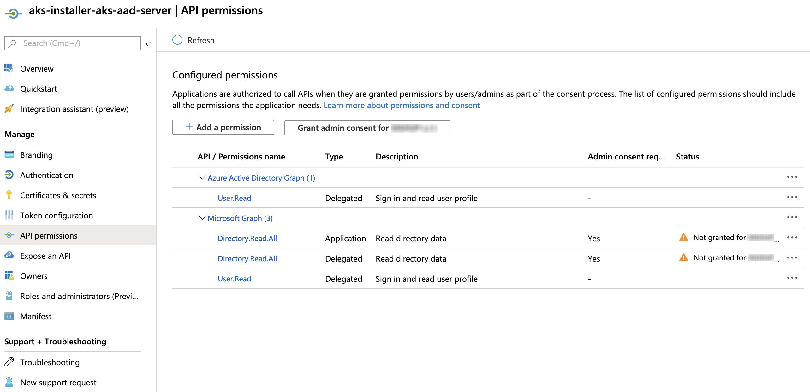

<h1>
    
    Fury AKS Installer
</h1>

<!-- <KFD-DOCS> -->

**Fury AKS Installer** deploys a production-grade Kubernetes Fury cluster on Azure Kubernetes Service (AKS).

If you are new to Kubernetes Fury please refer to the [official documentation][kfd-docs] on how to get started.

## Modules

The installer is composed of the following terraform modules:

|            Module             |                  Description                   |
| ----------------------------- | ---------------------------------------------- |
| [AKS][aks-module]             | Deploy a AKS cluster                           |

Click on each module to see its full documentation.

## Architecture

**Fury AKS Installer** deploys and configures a production-ready AKS cluster without having to learn all internals of the service.

The [AKS module][aks-module] deploys a **private control plane** cluster, where the control plane endpoint is not publicly accessible.

## Usage

### Requirements

- **Azure CLI** = `2.32.0`
- **Azure** account with enough permission to create an AKS Cluster.
- **terraform** = `0.15.4`
- `ssh` or **OpenVPN Client** - [Tunnelblick][tunnelblick] (on macOS) or [OpenVPN Connect][openvpn-connect] (for other OS) are recommended.

The [AKS module][aks-module] expects all the necessary networking infrastructure in place:

- A private network with a subnetwork for the AKS cluster and one for the bastion host
- Bastion host with OpenVPN installed

Please refer to the [example][example/networking] for the sample code to create the necessary infrastructure.

### Create AKS Cluster

To create the cluster via the installer:

1. Deploy the networking infrastructure and the bastion host
2. Install OpenVPN on the bastion
3. Configure access to the OpenVPN instance
4. Connect to the OpenVPN instance
5. Use the [AKS module][aks-module] to deploy the EKS cluster

⚠️ **The first time you try to create the cluster using the installer you will get an error.**

This is expected because the installer is creating an application in order to use Azure Active Directory (AAD) for user authentication.
Since this application will need to access AAD, a tenant admin must manually approve the requested API permissions as a security measure.

To grant the application the needed permissions, go to the Azure Portal:

1. Select Azure Active Directory > App registrations > All applications
2. Choose the application named <cluster_name>-aks-aad-server
3. In the left pane of the application, select API permissions
4. Select Grant admin consent, this button will not be available if your account is not a tenant admin.

## Useful links

- [AKS pricing](https://azure.microsoft.com/en-us/pricing/details/kubernetes-service/)
- [Committed use Instances pricing](https://azure.microsoft.com/en-us/pricing/details/virtual-machines/linux/)

<!-- Links -->

[aks-installer-docs]: https://docs.kubernetesfury.com/docs/installers/managed/aks/
[aks-module]: https://github.com/sighupio/fury-aks-installer/tree/master/modules/aks
[kfd-docs]: https://docs.kubernetesfury.com/docs/distribution/

[furyagent]: https://github.com/sighupio/furyagent
[tunnelblick]: https://tunnelblick.net/downloads.html
[openvpn-connect]: https://openvpn.net/vpn-client/

<!-- </KFD-DOCS> -->
<!-- <FOOTER> -->

## Contributing

Before contributing, please read first the [Contributing Guidelines](docs/CONTRIBUTING.md).

### Reporting Issues

In case you experience any problem with the module, please [open a new issue](https://github.com/sighupio/fury-kubernetes-networking/issues/new/choose).

## License

This module is open-source and it's released under the following [LICENSE](LICENSE)

<!-- </FOOTER> -->
